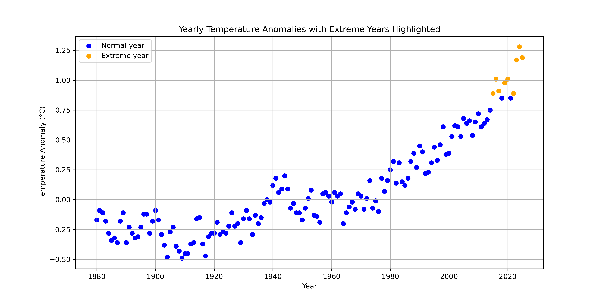
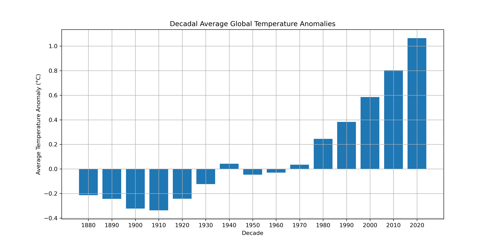
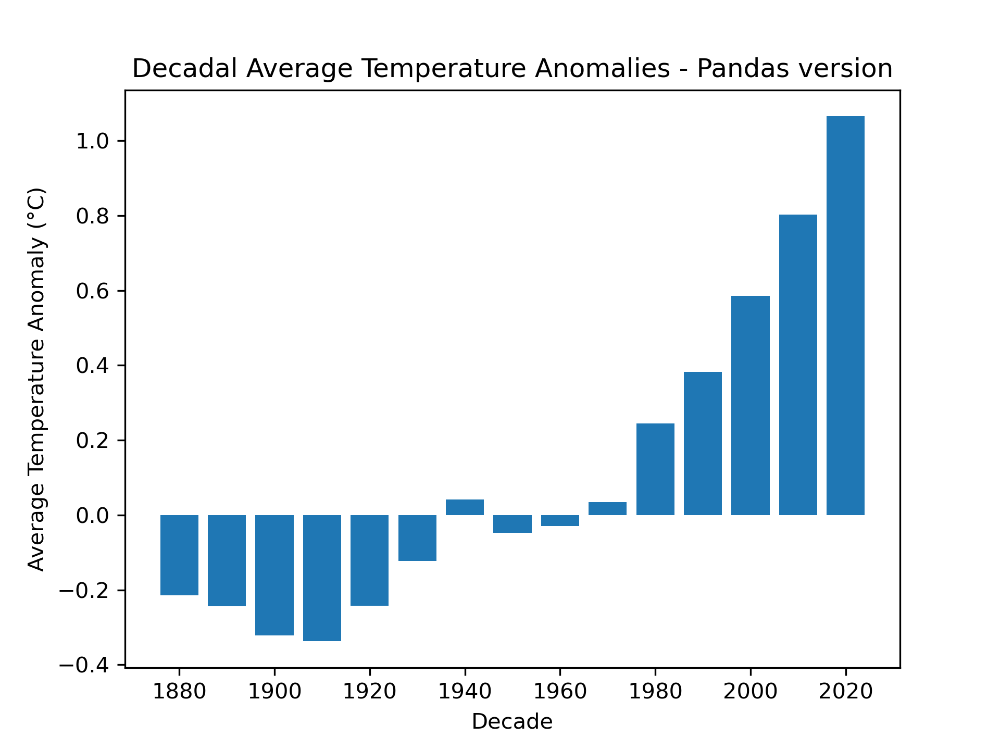
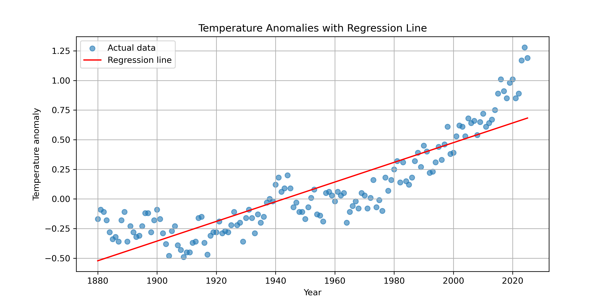
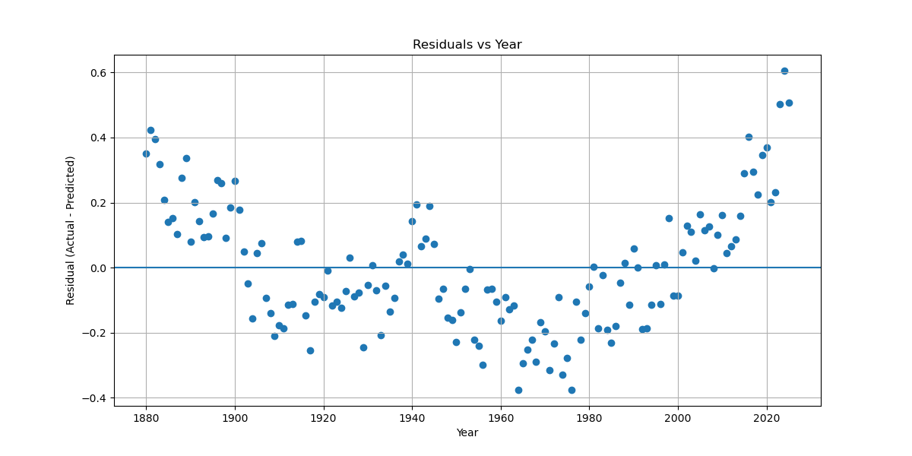
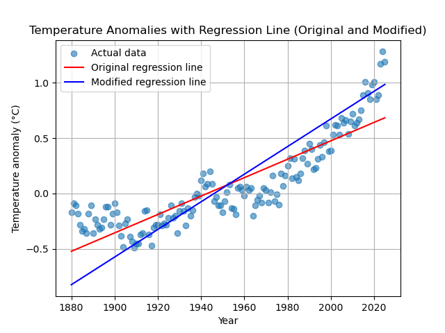
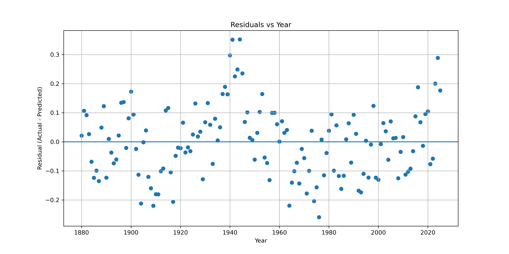

# Global Temperature Anomaly Analysis (Python)

Part of a growing portfolio in environmental data analysis and machine learning using Python.

## Project Overview

This project analyses global temperature anomaly data to explore long-term climate trends using Python.

The workflow includes:
- Data cleaning and validation (pure Python and pandas)
- Statistical analysis (mean, standard deviation, extreme values)
- Regression modelling (linear and quadratic)
- Visualisation (line plots, scatter plots, decadal averages, regression/residuals)

Key findings:
- A clear long-term warming trend, accelerating after ~1980
- Short-term yearly variability, but strong long-term consistency
- Increasing frequency of extreme anomaly years in recent decades
- Evidence that simple linear models are insufficient for climate data

This project demonstrates how simple data analysis techniques can reveal meaningful environmental patterns from real-world datasets.

## Key Features
Data Processing
•	Load and clean CSV climate data
•	Handle missing values appropriately
•	Extract structured time series (years, anomalies)
Statistical Analysis
•	Mean and standard deviation
•	Detection of extreme anomaly years
•	Decadal averaging for long-term trend smoothing
Visualisation
•	Line plots (temperature trends)
•	Scatter plots (data distribution)
•	Highlighting extreme years
•	Decadal averages (pure Python and pandas)

## Regression Modelling
This project now includes manual implementation of regression models from scratch:
Linear Regression
•	Built using least squares (no libraries)
•	Slope derived from covariance / variance relationship
•	Model:
[
y = mx + b
]
Quadratic Regression
•	Extended to capture non-linear trends
•	Solved using normal equations and matrix methods
•	Model:
[
y = ax^2 + bx + c
]

## Model Evaluation
Models are evaluated using:
•	Mean Squared Error (MSE)
•	Root Mean Squared Error (RMSE)
•	Residual analysis (critical for diagnosing model fit)

Key Insight:
A lower error does not automatically mean a better model — residual patterns must also be analysed.

## Dataset

The dataset contains global land-ocean temperature anomalies from 1880 to present.

Column used: J-D (January–December annual average)

Missing values handled appropriately (e.g. incomplete 2026 data)

## Results 

•	Global temperature anomalies show a clear long-term warming trend.

•	Warming accelerates significantly after ~1980.

•	The highest anomalies occur in the most recent years.

•	Even small anomaly increases (e.g. +0.15°C) represent significant shifts in global climate systems.

•	Linear regression underfits the data due to curvature

•	Quadratic regression significantly improves model fit

•	Residual analysis reveals:
o	Linear model → strong pattern (incorrect model type)
o	Quadratic model → mostly random, but slight underfitting in recent years

## Example Outputs

Temperature Trend

Extreme Years, Scatter Plot

Decadal Averages (Python)

Decadal Averages (Pandas)

Temperature Anomalies with Regression Line

Residuals vs Year (Linear Regression)

Temperature Anomalies with Regression Line (Original and Modified)

Linear vs Quadratic Regression

Residuals vs Year (Quadratic Regression)

## Interpretation

- Temperature anomalies measure deviation from a baseline (1951–1980), making them more reliable than absolute temperatures for detecting climate trends.

- Global temperature anomalies show a clear long-term warming trend, particularly accelerating after ~1980.

- While individual years fluctuate above and below the baseline, decadal averages smooth out this variability and reveal a consistent upward trend.

- Extreme years (defined as values more than 2 standard deviations from the mean) become more frequent in recent decades, indicating increasing variability alongside overall warming.

- The analysis highlights the importance of distinguishing between:
  - Short-term variability (year-to-year changes)
  - Long-term climate trends (multi-decade warming)

- Comparing pure Python and pandas approaches shows that:
  - Pure Python provides transparency and understanding of the underlying calculations
  - pandas enables faster, more efficient data analysis for larger datasets

- Comparing linear and quadratic regression models show that simple linear models are insufficient for climate data

This project demonstrates how simple data analysis techniques can reveal meaningful climate patterns using real-world environmental data.

## Model Comparison

Model	MSE	Fit Quality
Linear	~0.037	Poor (underfit)
Quadratic	~0.0145	Good (but not perfect)
		
## Key Insights

Temperature anomalies provide a clearer view of climate change than raw temperatures, showing how much the Earth is warming relative to a historical baseline.
This project demonstrates:
•	How regression models are derived from first principles
•	The importance of evaluating models beyond visual fit
•	How residuals reveal whether a model is appropriate
•	The trade-off between simplicity and accuracy

## Future Work
•	Polynomial models (higher-order)
•	Exponential modelling (for accelerating trends)
•	Multi-variable regression

## Technologies Used

•	Python
•	Jupyter Notebook
•	matplotlib
•	pandas
•	NumPy (for solving regression systems)
•	Git & GitHub

## How to Run

Clone the repository

Open the notebook:
temperature_anomaly.ipynb

Run all cells

## Author
Gaynor Jones

## Updates

## Update Mar 20th 2026
- Added anomaly detection using standard deviation
- Highlighted extreme temperature years
- Introduced decadal averaging for trend smoothing

## Update Mar 30th 2026

Produced multiple plots:
Yearly anomalies (line plot with max/min points annotated)
Scatter plot highlighting extreme years
Decadal averages (bar chart, both pure Python and pandas version)
Introduced pandas for data handling, demonstrating:
Data cleaning with to_numeric and dropna()
Grouping by decades with .groupby('Decade')['J-D'].mean()
Optional features included annotating plots and wrapping pandas preprocessing into a function.

## Update April 2026

Implemented linear regression from scratch
Extended to quadratic regression
Added MSE / RMSE evaluation
Introduced residual diagnostics
Performed full model comparison and selection

## Author

Gaynor Jones

## Related Projects

- [River Analysis Pipeline (Python)](https://github.com/GaynorJones/River_Analysis_Pipeline_Python)
